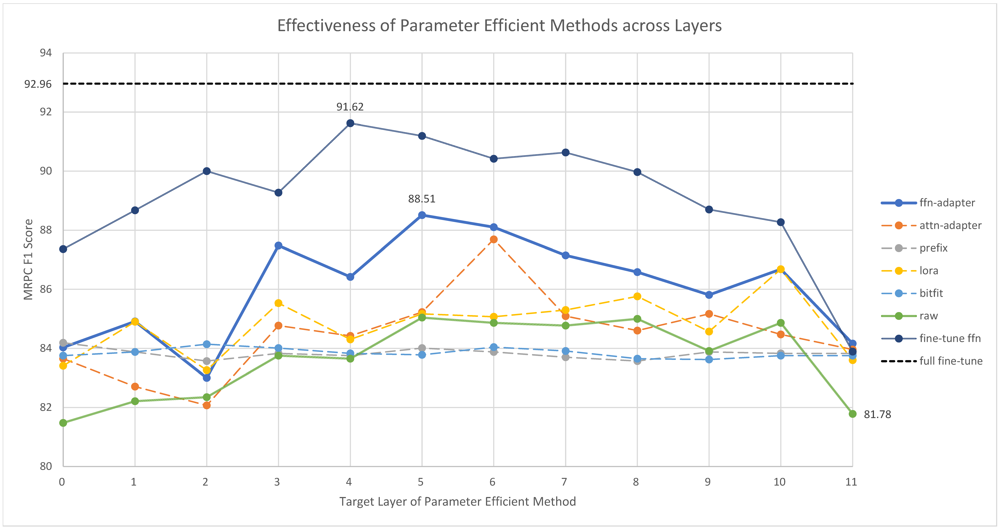

<!---
Copyright 2020 Jeremiah Zhou. All rights reserved.

Licensed under the Apache License, Version 2.0 (the "License");
you may not use this file except in compliance with the License.
You may obtain a copy of the License at

    http://www.apache.org/licenses/LICENSE-2.0

Unless required by applicable law or agreed to in writing, software
distributed under the License is distributed on an "AS IS" BASIS,
WITHOUT WARRANTIES OR CONDITIONS OF ANY KIND, either express or implied.
See the License for the specific language governing permissions and
limitations under the License.
-->

# On the Effectiveness of Parameter Efficient Methods: Sparsity and FFNs Matter
Repo for preprint paper []().
## Environment
Here are the steps to create the environment from scratch. We presuppose the installation of `conda`.

```bash
# create conda env hgf, change name if needed
conda env create -n hgf python=3.8.13 -y
conda activate hgf
# install packages
conda install pytorch==1.11.0 cudatoolkit=11.3 -c pytorch
pip install transformers==4.22.0 datasets==2.1.0
# for easy debugging
# pip install debugpy==1.6.0
# it is also applicable to install packages from `requirements.txt`
# pip install -r requirements.txt
```

## GLUE tasks

Based on the script [`run_glue.py`](https://github.com/huggingface/transformers/blob/main/examples/pytorch/text-classification/run_glue.py).

Fine-tuning the library models for sequence classification on the GLUE benchmark: [General Language Understanding
Evaluation](https://gluebenchmark.com/). 
## Main Results
### MRPC Results

### GLUE Results

### Scale-up Results

## Usage
Useful scripts are under the `scripts` directory. Sample usage with respect to `adapters` is as follows. Scripts for other parameter efficient methods have similar usage. Each script is highly customizable. For help on arguments defined in the script, please resort to the respective argument file under `argument_classes`. 
```bash
bash scripts/adapter_hyper.sh
```
### Other Information
Hyper-parameter search based on `ray-tune` and `PBT` algorithm is implemented in `run_glue_hyper_search.py`. `hyper_search.sh` is a useful script that defines relevant arguments. 